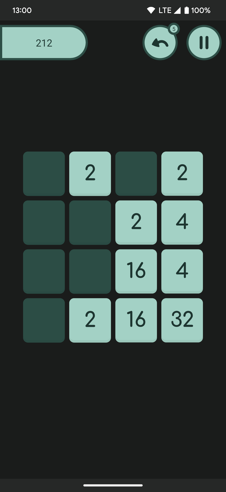

# 2048
KMM version of 2048 game 

## Screenshots




## How to build Android app

To build `debug` version just run such commands:
```
./gradlew :shared:kspCommonMainKotlinMetadata
./gradlew :shared:compileDebugKotlinAndroid
./gradlew :androidApp:assembleDebug
```

## UI screenshot tests

For testing UI elements written on compose uses [paparazzi](https://github.com/cashapp/paparazzi) library.

To update reference image, just run command:
```
./gradlew MODULE:recordPaparazziDebug
```
example:
```
./gradlew androidDesignSystem:recordPaparazziDebug
./gradlew androidPhoneScreen:recordPaparazziDebug
```

To run tests and verify output images, run this command:

```
./gradlew androidDesignSystem:verifyPaparazziDebug
```

or

```
./gradlew androidApp:verifyPaparazziDebug
```

## Localization

To support translations for several platforms uses [Twine](https://github.com/scelis/twine) tool.

If you add some changes in `strings/strings.txt`, please update resource files with this command:

```
sh scripts/update_localization.sh
```

## New dependencies checker

To check new versions of gradle dependencies uses [such plugin](https://github.com/ben-manes/gradle-versions-plugin)

For checking it locally you can run one of this commands:

```
./gradlew androidApp:dependencyUpdates --stacktrace
./gradlew androidDesignSystem:dependencyUpdates --stacktrace
./gradlew shared:dependencyUpdates --stacktrace
```
